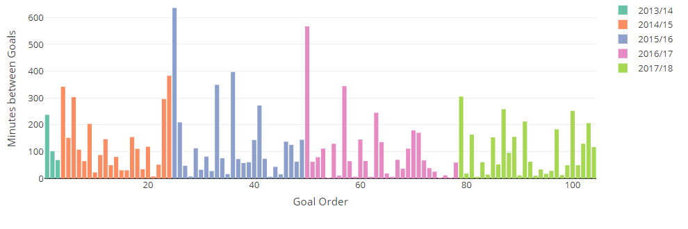

# Week 2 {-}

Not so many shocks in Round 2.    

 Three teams remain with 100% records. Manchester United have looked the most impressive and it is not until week 8 that they meet any of the five teams that finished above them last year.
 
 Huddersfield manager David Wagner will probably just be grateful to have six points in the bag so soon and Tony Pulis will be looking to put his feet up even earlier than usual as his WBA teams tend to do once they reach the 40 point safety level


First matchup between serious title candidates and the Spurs v Chelsea game did not disappoint. Two Dele Alli inspired free kicks (one for each side) left the game at 1-1 before Lloris's gaffe provided the visitors with a win


## Kane Cant {-}

Well he had eight shots but yet again no August goals for Harry Kane 

  Here are how his goals have been distributed by month


```{r kane_august_02}

data <- playerGame %>%
  filter(PLAYERID == "KANEH" & mins > 0) %>%
  mutate(month = months(gameDate), monthOrder = month(gameDate)) %>%
  select(gameDate, mins, Gls, month, monthOrder, name) %>%
  group_by(month, monthOrder) %>%
  summarise(apps = n(),
            mins = sum(mins),
            Gls = sum(Gls))

data %>%
  plot_ly(
    x =  ~ fct_reorder(month, monthOrder),
    y =  ~ Gls,
    hoverinfo = "text",
    text =  ~ paste0("Mins: ", mins, "<br>Goals: ", Gls)
  ) %>%
  add_markers(size =  ~ mins) %>%
  layout(
    xaxis = list(title = ""),
    yaxis = list(title = "EPL Goals"),
    title = "Premier League Goals by Month",
    # ideally get name in there
    margin = list(b = 60)
    
  ) %>%  config(displayModeBar = F, showLink = F)

```

He has been hit by a fair amount of injury at the beginning of some seasons and has not really get going until November in the past

 I have extended this to cover any player

```{r all_august_02}

# crosstalk version

data <- playerGame %>% 
  filter(mins>0) %>% 
  mutate(month=months(gameDate),monthOrder=month(gameDate)) %>% 
  select(gameDate,mins,Gls,month,monthOrder,name,PLAYERID) %>% 
  group_by(month,monthOrder,name,PLAYERID) %>% 
  summarise(apps=n(),mins=sum(mins),Gls=sum(Gls))

sd <- SharedData$new(data)

fs <- filter_select(
id = "player",
label = "Select or Type in Player",
sharedData = sd,
group =  ~ name,
allLevels = FALSE,
multiple = FALSE
)


# this is needed as crosstalk does not work nicely with bootstrap, apparently
fs_nobootstrap <- fs

attr(fs_nobootstrap, "html_dependencies") <- Filter(
  function(dep) {dep$name != "bootstrap"},
  attr(fs_nobootstrap, "html_dependencies")
)


monthChart <- sd %>% 
  plot_ly(x=~fct_reorder(month, monthOrder),y=~Gls,
          hoverinfo="text",
          text=~paste0("Mins: ",mins,"<br>Goals: ",Gls)) %>% 
  add_markers(size=~mins) %>% 
  layout(xaxis=list(title=""),
         yaxis=list(title="EPL Goals"),
         title="Premier League Goals by Month", # ideally get name in there
         margin=list(b=60)
         
         ) %>%  config(displayModeBar = F,showLink = F)


  tagList(
  fs_nobootstrap,
  br(),
  monthChart
)


```

Check out Rooney. He tails off at the end of the season - though Manchester United might have already taken care of business by May


<p class="factoid">WBA's Robson-Kanu joins David Lee, Klasnic and Zamora as the four subs(at the time of writing) who have scored and then seen red in Premier League history</p>

```{r sub_goal_red_02}


grid.newpage()


# A more complicated diagram Demonstrating external area labels
venn.plot <- draw.pairwise.venn(
  area1 = 2127,
  area2 = 62,
  cross.area = 4,
  category = c("Scored", "Dismissed"),
  fill = c("blue", "red"),
  lty = "blank",
  cex = 2,
  cat.cex = 2,
  cat.pos = c(300, 105),
  cat.dist = 0.09,
  cat.just = list(c(-1,-1), c(1, 1)),
  ext.pos = 30,
  ext.dist = -0.05,
  ext.length = 0.85,
  ext.line.lwd = 2,
  ext.line.lty = "dashed"
)

```


## Attendances {-}

Bournemouth's small ground has held the average attendances down a bit since their promotion but the restoration of Newcastle and, more significantly, the move of Spurs to Wembley suggests records could be set this season

Average Crowds by Season Click on plot to see Individual Teams and hover for details
```{r crowds_02}

avCrowds <- teamGames %>%
  ungroup() %>%
  filter(venue == "H") %>%
  mutate(year = str_sub(season, 1, 4)) %>%
  group_by(year, TEAMNAME, season) %>%
  summarize(avCrowd = round(mean(CROWD), 0)) %>%
  ungroup() %>%
  arrange(season)


exploding_boxplot(
  avCrowds,
  y = "avCrowd",
  group = "year",
  #color = "spray", # looks like has to be a range of colors if you group- which you need to to sep data
  label = "TEAMNAME",
  # could be another column name but not combo
  iqr = 2,
  margin = list(
    bottom = 50,
    left = 70,
    top = 20,
    right = 20
  ),
  xlab = "",
  ylab = ""
)

```

Average crowds are approaching 38,000, more than 75% higher than the inaugural season 

 Click on any box to view individual club averages by hovering the points
 
## Aguero's bogey team {-}

With his brief sojurn out of the team at the tail end of last season, the wealth of attacking at Manchester City's disposal and the continuing rumours of possible purchase of Alexis Sanchez, it was probably not the best time for Aguero to be facing an Everton team against whom he has struggled, relatively speaking, to score.

Once again he came up empty-handed

```{r aguero_02}

played <- playerGame %>%
  filter(PLAYERID == "AGUEROS" & mins > 0) %>%
  arrange(desc(gameDate)) %>%
  group_by(Opponents, name, PLAYERID) %>%
  tally()

playerGame %>%
  filter(PLAYERID == "AGUEROS" & mins > 0) %>%
  arrange(desc(gameDate)) %>%
  group_by(Opponents) %>%
  mutate(last = row_number()) %>%
  filter(Gls > 0) %>%
  select(Opponents, gameDate, last, Gls) %>%
  slice(1) %>% # latest match scired in
  right_join(played) %>%
  arrange(desc(last)) %>%
  select(
    Opponents,
    Date = gameDate,
    `last scored` = last,
    `All Games` = n
  ) %>%
  DT::datatable(
    class = 'compact stripe hover row-border order-column',
    rownames = FALSE,
    options = list(
      paging = TRUE,
      searching = TRUE,
      info = FALSE
    )
  )


```

Next up is Bournemouth, against whom he scored two games ago


---

## Totally Football and Guardian Weekly Review Podcasts {-}

<iframe width="100%" height="300" style="background-color:transparent; display:block; padding: 0; max-width: 700px;" frameborder="0" allowtransparency="allowtransparency" scrolling="no" src="//embeds.audioboom.com/posts/6225033-man-united-looking-menacing-ill-advised-celebrations-and-west-brom-s-axis-of-evil/embed/v4?eid=AQAAAPyVm1mJ_F4A" title="audioBoom player"></iframe>

<iframe width="100%" height="300" style="background-color:transparent; display:block; padding: 0; max-width: 700px;" frameborder="0" allowtransparency="allowtransparency" scrolling="no" src="//embeds.audioboom.com/posts/6225029-is-the-wembley-curse-fake-news-football-weekly/embed/v4?eid=AQAAAD2Wm1mF_F4A" title="audioBoom player"></iframe>

---

## Results and Table {-}

```{r results_02}


hth %>%
  filter(season == "2017/18" &
           gameDate >= "2017-08-15" &
           gameDate <= "2017-08-21") %>% ## may need to put in day later?
  filter(venue == "H") %>%
  arrange(team) %>%
  select(Home = team, GF, GA, Away = OppTeam) %>%
  DT::datatable(
    rownames = FALSE,
    class = 'compact stripe hover row-border',
    colnames = c('', '', '', ''),
    options = list(
      paging = FALSE,
      searching = FALSE,
      info = FALSE,
      columnDefs = list(list(
        width = '40%', targets = list(0, 3)
      ))
    ),
    width = 250
  )
```


```{r standings_02}


hth %>%
  filter(season == "2017/18" & gameDate <= "2017-08-21") %>%
  group_by(team) %>%
  mutate(
    W = ifelse(res == "Win", 1, 0),
    L = ifelse(res == "Loss", 1, 0),
    D = ifelse(res == "Draw", 1, 0)
  ) %>%
  summarise(
    P = n(),
    Pts = sum(points),
    W = sum(W),
    D = sum(D),
    L = sum(L),
    GD = sum(GF) - sum(GA),
    GF = sum(GF)
  ) %>%
  arrange(desc(Pts), desc(GD), desc(GF), team) %>%
  DT::datatable(
    class = 'compact stripe hover row-border order-column',
    colnames = c('', 'P', 'Pts', 'W', 'D', 'L', 'GD', 'GF'),
    rownames = TRUE,
    options = list(
      paging = FALSE,
      searching = FALSE,
      info = FALSE
    )
  )

```


## Final Factoid {-}

<p class="factoid">The +8 goal difference for Man Utd after two games is their best ever in the Premier League and trails only the 2010/11 Chelsea side that inflicted 6-0 lickings to WBA and Wigan to start that season</p> 

***

## End of Season Update {-}

Well Huddersfield werer extremely grateful for those six points as they survived relegation by 4
As for Tony Pulis? Well he did get to put his feet up early but only because he was sacked after just 12 matches.He soon re-emerged in the Championship with Middlesbro and...
Lloris was definitely under par this season and with Alli regressing from an admittedly high level, Tottenham were reliant on the consistency of Kane, Eriksen and Son to secure a top 4 spot

### Kane Cant {-}

It was the same old story as after a sluggish start 

 


This chart s jut one of many that are updated weekly for all players on the [premiersoccerstats site](www.premiersoccerstats.com)


As you can see, his longest goal drought has always come at the start of the season - other than when it was merely his second longest. Clearly more than a coincidence, Spurs will need to rectify the situation if they are to put themselves in a good position for an early crack at the title in the future. A summer with the World Cup may not help in this regard

### Attendances {-}

Average crowds exceeded 38,000 for the first time; with the return of Newcastle and Tottenham's temporary accommodation at Wembley major factors. 

Here are the top two for each year

```{r crowds_02u}

teamGames %>%
  filter(venue == "H") %>%
  mutate(year = str_sub(season, 1, 4)) %>%
  group_by(year, TEAMNAME, season) %>%
  summarize(avCrowd = round(mean(CROWD), 0)) %>%
  group_by(season, year) %>%
  arrange(desc(avCrowd)) %>%
  mutate(pos = row_number()) %>%
  slice(1:2) %>%
  plot_ly(x = ~ year,
          y =  ~ avCrowd,
          color =  ~ pos) %>%
  add_lines(showlegend = FALSE) %>%
  add_markers(
    showlegend = FALSE,
    hoverinfo = "text",
    text = ~ paste0(TEAMNAME, "<br>", avCrowd)
  ) %>%
  hide_colorbar() %>%
  layout(margin=list(b=100),
    title = "Leading Two Average Home Attendances by Season",
    xaxis = list(title = ""),
    yaxis = list(title = "Average Attendance", rangemode = "tozero")
  ) %>%
  config(displayModeBar = F, showLink = F)
```

Other than Season 1, when Liverpool led the way, Manchester United rule the roost
Over the years, runners up have included the Merseysiders, Newcastle and, more recently, Arsenal. This was the first season Tottenham have had the honour as they wait for White Hart Lane to be rebuilt, where the planned capacity of 62,000 will still likely earn them second place

#### Aguero Woe {-}

Aguero did not figure in the squad for City's away win at Everton

***

## Code Tips {-}

 * crosstalk
 * VennDiagram
 * explodingboxplot
 * plotly - rangemode, showlegend
 * DT - colnames