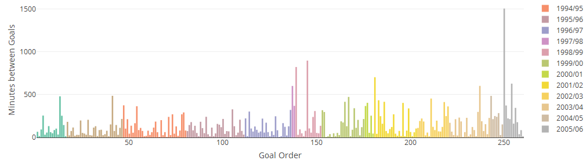

# Week 4 {-}


## Game of the week {-}

United's first real test a  2-2 draw at Stoke. Still look going forward but defensive frailties may be exposed by top opposition

```{r topGame_04}

embed_youtube("eNBb-vP5Lco", width = 420, height = 315, frameborder = 0,
  allowfullscreen = TRUE, query = NULL) 


```


***
 
## It must be September - Kane starts scoring

The first one was a bit of a fluke but he reaches the 80 goal mark at a younger age than any who have reached that level in fewer appearances

```{r eighty_goals_04}


players <- c("HENRYT", "KANEH", "SHEAREA", "AGUEROS", "VANNISR")

playerGame %>%
  filter((START + subOn > 0) & PLAYERID %in% players) %>%
  select(name, PLAYERID, Gls, Assists, age, gameDate) %>%
  arrange(gameDate) %>%
  group_by(name, PLAYERID) %>%
  mutate(
    gameOrder = row_number(),
    points = Assists + Gls,
    cumGoals = cumsum(Gls),
    cumAssists = cumsum(Assists),
    cumPoints = cumsum(points)
  ) %>%
  plot_ly(x =  ~ age,
          y =  ~ cumGoals,
          color =  ~ name) %>%
  add_lines() %>%
  
  layout(xaxis = list(title = "Age"),
         yaxis = list(title = "Cumulative Goals")) %>%  config(displayModeBar = F, showLink = F)
```

 Of course, Shearer had already played in the old First Division and the others had performed in foreign leagues first.
 
*** 


<p class="factoid">This season, no-one joined the fourteen players who have scored on each of their first four games in an EPL season. Mane was the last one standing but his decision to leave a foot impression on Ederson's face ensured that he would not be added to the group</p>

***

## Palace racking up the records

 * First time since 1924/5 that a top-tier team (Preston NE) have started a season with four games goalless and pointless
 * Became only team to have two distinct five game runs of EPL games without a goal (Ipswich 7 is record)
 * Only team ever to have only scored in one of nine consecutive EPL games (4-0 v Hull)
 * Handed Frank de Boer the shortest managerial reign in EPL history
 
*** 


 
## Player Rotation

Another season, another manager but the same old Watford. They have already utilized 22 players after 4 league games and do not have European games to take into account. On the other hand Liverpool do and the 21 they have put on the pitch already exceeds one full season and matches another

```{r rotation_04}

x <-
  playerGame %>%
  group_by(name, PLAYERID, TEAMNAME, season) %>%
  summarise(tot = sum(mins)) %>%
  filter(tot > 0) %>%
  ungroup() %>%
  group_by(TEAMNAME, season) %>%
  tally() %>%
  arrange(desc(n))

x %>%
  filter(TEAMNAME == "Liverpool") %>%
  plot_ly(x =  ~ season, y =  ~ n)  %>%
  add_bars(color = I('red'), opacity = 0.5) %>%
  layout(
    margin = list(b = 100),
    xaxis = list(title = ""),
    yaxis = list(title = "Number of Players Used")
  ) %>%  config(displayModeBar = F, showLink = F)

```

Liverpool finished third in 1995/6 with young talents like Fowler, Redknapp and McManaman replacing the Barnes and Rush era.    
 2015/6 was when Liverpool switched managers - Klopp took over from Rogers - a change often heralding different lineups

***

<p class="factoid">It has been almost 3,400 minutes since Jason Puncheon, Crystal Palace mid-fielder,
last scored a Premier League goal. Since then, 295 other players have achieved the feat </p>

***

## Totally Football and Guardian Weekly Review Podcasts


<iframe width="100%" height="300" style="background-color:transparent; display:block; padding: 0; max-width: 700px;" frameborder="0" allowtransparency="allowtransparency" scrolling="no" src="//embeds.audioboom.com/posts/6289238-jaw-dropping-performances-by-mane-and-sane-as-frank-de-boer-is-shown-the-door/embed/v4?eid=AQAAACRJt1lW918A" title="audioBoom player"></iframe>

<iframe width="100%" height="300" style="background-color:transparent; display:block; padding: 0; max-width: 700px;" frameborder="0" allowtransparency="allowtransparency" scrolling="no" src="//embeds.audioboom.com/posts/6289276-controversial-dismissals-at-both-ends-of-the-premier-league-football-weekly/embed/v4?eid=AQAAAHJJt1l8918A" title="audioBoom player"></iframe>

***

## Results and Table

```{r results_04}

hth %>%
  filter(season == "2017/18" &
           gameDate >= "2017-08-28" & gameDate <= "2017-09-11") %>%
  filter(venue == "H") %>%
  arrange(team) %>%
  select(Home = team, GF, GA, Away = OppTeam) %>%
  DT::datatable(
    rownames = FALSE,
    class = 'compact stripe hover row-border',
    colnames = c('', '', '', ''),
    options = list(
      paging = FALSE,
      searching = FALSE,
      info = FALSE,
      columnDefs = list(list(
        width = '40%', targets = list(0, 3)
      ))
    ),
    width = 250
  )
```


```{r standings_04}

hth %>% 
  filter(season=="2017/18"&gameDate<="2017-09-11") %>% 
  group_by(team) %>% 
  mutate(W = ifelse(res=="Win",1,0),L = ifelse(res=="Loss",1,0),D = ifelse(res=="Draw",1,0)) %>%
  summarise(P=n(),Pts=sum(points),W=sum(W),D=sum(D),L=sum(L),GD=sum(GF)-sum(GA),GF=sum(GF)) %>% 
  arrange(desc(Pts),desc(GD),desc(GF),team) %>%
  DT::datatable(class='compact stripe hover row-border order-column',colnames = c('', 'P', 'Pts', 'W','D', 'L', 'GD','GF'),
                rownames=TRUE,options= list(paging = FALSE, searching = FALSE,info=FALSE))


```


***

## Final Factoid

<p class="factoid">If Crystal Palace lose their next game without finding the net, it will be the first time in the top English Division that a team has kicked off a campaign with five goalless, scoreless games - matching Hartlepool (tier 3 1938/9) and Sunderland (tier 2 1985/6)</p>


---

## End of Season Update {-}


### It must be September - Kane starts scoring {-}

And kept scoring. As the graph above shows, he has now cracked the 100 goal barrier much younger than his rivals and if he continues to be granted [goal he didn't score](https://www.theguardian.com/football/2018/apr/11/harry-kane-awarded-goal-stoke-twitter-premier-league-mo-salah) he will do so


```{r eighty_goalsu}


# look at longest droughts of any players
chosen <- c("HENRYT", "KANEH", "SHEAREA", "AGUEROS", "VANNISR")


## Minutes passed since a player has scored (can add assisted)

# Function to list every minute played
plDroughtFun <- function(df) {
  expand.grid(c(df$on:df$off), df$PLAYER_MATCH)
}

# need to add other column as are matching on TIME
gls <- goals %>%
  mutate(scored = 1)

#maybe add 

#gap <- vector("integer",length(chosen))

max_gap <- function(player)
  ({
    print(player)
    
    games <- playerGame %>%
      filter(PLAYERID == player & mins > 0) %>%
      select(PLAYERID,
             name,
             PLAYER_MATCH,
             START,
             on,
             offA,
             gameDate,
             TEAMMATCHID) %>%
      mutate(on = as.integer(on), off = as.integer(offA)) %>%
      mutate(on = ifelse(is.na(on), 1, on), off = ifelse(is.na(off), 90, off))
    
    # create list so can apply function above with purrr
    games_list <- split(games, 1:nrow(games))
    mins <- map_df(games_list, plDroughtFun)
    
    
    names(mins) <- c("TIME", "PLAYER_MATCH")
    mins <- mins %>%
      left_join(games) %>%
      select(TIME, PLAYER_MATCH, gameDate)
    
    # create gaps between goals
    goalData <- mins %>%
      left_join(gls)  %>%
      select(PLAYER_MATCH, TIME, gameDate, scored) %>%
      arrange(gameDate, TIME) %>%
      mutate(minOrder = row_number(), goal = ifelse(is.na(scored), 0, 1)) %>%
      filter(goal == 1 |
               minOrder == max(minOrder)) %>% # to take account of current spell
      mutate(minslag = lag(minOrder), gap = minOrder - minslag)
    
    # account for gap at beginning of career
    goalData[1, ]$gap <- goalData[1, ]$minOrder
    
    
    # combine back to playergame for team data
    info <-  goalData %>%
      left_join(playerGame)
    
    max(info$gap)
    
  })      
    
    # map players to create integer vector
    gap <- map_int(players, max_gap)
    
    # create a tibble
    l <- list(player = players, gap = gap)
    df <- as.tibble(l)
    
    #plot results
    df %>%
      left_join(playerGame, by = c("player" = "PLAYERID")) %>%
      select(LASTNAME, gap) %>%
      unique() %>%
      plot_ly(x =  ~ LASTNAME, y =  ~ gap) %>%
      add_bars() %>%
      layout(
        title = "Longest Goal Droughts by Ace Strikers",
        xaxis = list(title = ""),
        yaxis = list(title = "Minutes without Scoring")
      )
 
```

Shearer's drought stands out but it was at the tail-end of his career when he was in his mid-30's. He actually broke it by scoring for Newcastle against one of his previous clubs, Blackburn. His second longest spell was 897 minutes



---

### Player Rotation {-}

?? In the end, Liverpool ended up in the middle of the pack with their modal average of 26 players actually appearing on the pitch in the season

The overall rankings for the year are

```{r rotation_u}


playerGame %>%
  filter(season == "2017/18" & mins > 0) %>%
  select(TEAMNAME, PLAYERID) %>%
  unique() %>%
  count(TEAMNAME, sort = TRUE) %>%
  plot_ly(x =  ~ n, y =  ~ fct_reorder(TEAMNAME, n)) %>%
  add_bars(color = I("lightblue")) %>%
  layout(
    title = "Number of Players used by Club",
    margin = list(l = 120, pad = 5),
    xaxis = list(title = 'Count'),
    yaxis = list(title = "")
  ) %>% config(displayModeBar = F, showLink = F)

```

Everton were one of many clubs with relegation fears that switched managers mid season,
whilt Eddie Howe, at Bournemouth, enjoyed his sixth season at the reigns

The overall range in player usage has ranged from 19 (Liverpool 1995/96) to 39
 Fulham(2013/14). Amazingly, Fulham additionally had six players who never made it off the bench. Not so surprisingly, they were relegated with noe of their forwards even reaching the 5-goal mark
 
---

Puncheon's goal drought was suspended at 3,614 minutes when he suffered a season-ending injury

***

## Code Tips {-}

 * plotly - use of color,opacity,margin,padding parameters
 * purrr  - map_int() function
 * tibble - basic list to tibble usage
