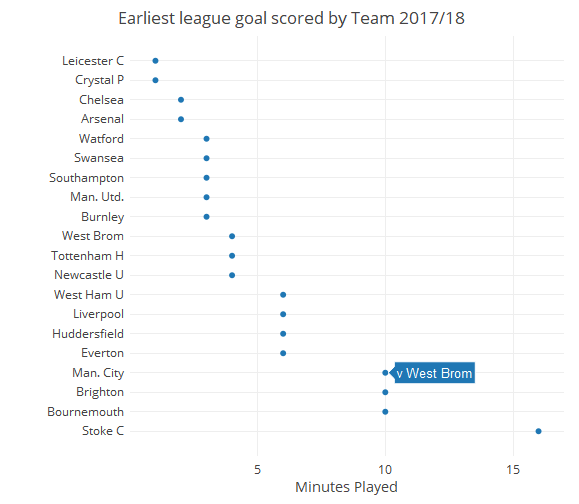

# Week 20 {-}


Burnley hold Manchester United at Old Trafford whilst all the other top clubs record victories. Liverpool's five goal haul now places them second in league with 46 but they still trail Man City's 49 goal difference


***

## Pardew Bounce {-}

Alan Pardew has a rep as someone who gives a team an instant return, extended runs (good and bad) and ultimate disappointment   

Well stage one hasn't happened with WBA as they have yet to win a game in six but how true is it of his four other Premier managerships. Zoom into bottom left hand corner to view first six games


```{r pardew_20}

## Take account of managers who are in situ
managers[is.na(managers$Left), "Left"] <-
  as.Date(Sys.Date(), origin = '1970-01-01')

managerGame <- managers %>%
  mutate(name = paste(FirstName, Lastname)) %>%
  group_by(ManagerID, ManagerTeam) %>%
  inner_join(standings, by = c("TEAMNAME" = "team")) %>%
  select(
    Lastname,
    FirstName,
    name,
    ManagerID,
    ManagerTeam,
    Joined,
    Left,
    TEAMNAME,
    gameDate,
    res,
    GF,
    GA,
    position
  ) %>%
  filter(gameDate >= as.Date(Joined) & gameDate <= as.Date(Left)) %>%
  mutate(points = ifelse(res == "Win", 3, ifelse(res == "Draw", 1, 0))) %>%
  ungroup()


managerGame %>%
  arrange(gameDate) %>%
  group_by(ManagerID, name, TEAMNAME) %>%
  mutate(cumPoints = cumsum(points), gameOrder = row_number()) %>%
  filter(ManagerID == "PardewA") %>%
  group_by(TEAMNAME) %>%
  plot_ly(
    x =  ~ gameOrder,
    y =  ~ cumPoints,
    color =  ~ TEAMNAME,
    colors = "Accent"
  ) %>%
  add_lines(line = list(shape = "hv")) %>%
  layout(
    title = "Cumulative Points by Games Played",
    xaxis = list(title = 'Points'),
    yaxis = list(title = "Games Managed")
  ) %>%
  config(displayModeBar = F, showLink = F)

```

For the three teams he has managed to 50 games+, there is only a 5 point span at the half-century mark

 His performaces after 6 games has been, in chronological order
 
* West Ham United (11)
* Charlton (8)
* Newcastle United (10)
* Crystal Palace (10)
* WBA (3)
       
  So, by some margin, his worst start. The six game span has also only yielded two goals for
  
  Indeed, over the last 17 games, he has only registered one victory
  
```{r pardewb_20}

df <- managerGame %>%
  filter(ManagerID == "PardewA") %>%
  arrange(gameDate) %>%
  mutate(cat = ifelse(res == "Win", 1, 0)) %>%
  #group_by(ManagerID)  %>%
  mutate(tot_sum = roll_sum(cat, 17, align = "right", fill = NA))

df %>%
  filter(!is.na(tot_sum)) %>%
  mutate(order = row_number()) %>%
  plot_ly(x = ~ order, y = ~ tot_sum) %>%
  add_lines(
    color = I("lightgrey"),
    hoverinfo = "text",
    text =  ~ paste0(GF, "-", GA),
    showlegend = FALSE
  ) %>%
  add_markers(
    color = ~ TEAMNAME,
    colors = "Accent",
    hoverinfo = "text",
    symbol = I(16),
    text =  ~ paste0(GF, "-", GA)
  ) %>%
  layout(
    title = "Alan Pardew - Wins in 17 game windows<br>Hover for Score",
    xaxis = list(title = ""),
    yaxis = list(title = "Wins")
  ) %>%  config(displayModeBar = F, showLink = F)

```
  
 
 

***
<p class="factoid">The worst winless run was endured by Paul Jewell who took over bottom club Derby on 28 Nov 2007. They did not
win in the remaining 24 games of the season under his stewardship</p>
***


## Man City plough on {-}

With yet another victory - via Sterlings 13th goal of the season (as many as he has scored in the past two seasons combined) -
City are now one shy of the 19 consecutive wins record in the big leagues of Bayern Munich

One surprising aspect of this, is that they have yet to score in the first nine minutes of any game. Only Stoke have failed to score earlier



They have not conceded over that time period either but, nevertheless they would currently be hovering above the relegation zone if games were played over nine rather than ninety minutes


```{r}

timeSelect <- 9
elapsed <- scoreLines %>%
  arrange(mins) %>%
  group_by(TEAMMATCHID, OPPMATCHID, MATCHID) %>%
  mutate(cumGF = cumsum(GF), cumGA = cumsum(GA)) %>%
  filter(mins == timeSelect)

standings %>%
  filter(season == "2017/18") %>%
  select(team, MATCHID, TEAMMATCHID) %>%
  left_join(elapsed) %>%
  left_join(standings, by = c("team" = "team", "MATCHID" = "MATCHID")) %>%
  select(team, OppTeam, gameDate, GF = cumGF.x, GA = cumGA.x, season) %>%
  mutate(points = case_when(GF > GA ~ 3,
                            GA > GF ~ 0,
                            GF == GA ~ 1)) %>%
  group_by(team) %>%
  summarize(
    Points = sum(points),
    GF = sum(GF),
    GA = sum(GA),
    GD = GF - GA,
    Games = n()
  ) %>%
  select(team, Points, GF, GA, GD) %>%
  arrange(desc(Points), desc(GD), team) %>%
  DT::datatable(
    class = 'compact stripe hover row-border order-column',
    rownames = TRUE,
    options = list(
      paging = FALSE,
      searching = FALSE,
      info = FALSE
    )
  )

```

_NB This chart updates as the season progresses_


***

## Tweet of the Week {-}


<blockquote class="twitter-tweet" data-lang="en"><p lang="en" dir="ltr">Updated <a href="https://twitter.com/hashtag/EPL?src=hash&amp;ref_src=twsrc%5Etfw">#EPL</a> stats site to inc Boxing Day<a href="https://t.co/5dQ5BrYsv5">https://t.co/5dQ5BrYsv5</a><a href="https://twitter.com/hashtag/THFC?src=hash&amp;ref_src=twsrc%5Etfw">#THFC</a> Son has second 3-assist game in last four and topping <a href="https://twitter.com/hashtag/Kane?src=hash&amp;ref_src=twsrc%5Etfw">#Kane</a> in assists+goals per minute <a href="https://t.co/H6ydvWvqcx">pic.twitter.com/H6ydvWvqcx</a></p>&mdash; Andrew Clark (@pssGuy) <a href="https://twitter.com/pssGuy/status/946114232990310400?ref_src=twsrc%5Etfw">December 27, 2017</a></blockquote>
<script async src="https://platform.twitter.com/widgets.js" charset="utf-8"></script>


***

## Totally Football and Guardian Weekly Review Podcasts {-}

<iframe width="100%" height="300" style="background-color:transparent; display:block; padding: 0; max-width: 700px;" frameborder="0" allowtransparency="allowtransparency" scrolling="no" src="//embeds.audioboom.com/posts/6571348-calendar-year-records-the-return-of-tony-pulis-and-is-vvd-vfm/embed/v4?eid=AQAAAOokRVpURWQA" title="audioBoom player"></iframe>
***
<p>

<iframe width="100%" height="300" style="background-color:transparent; display:block; padding: 0; max-width: 700px;" frameborder="0" allowtransparency="allowtransparency" scrolling="no" src="//embeds.audioboom.com/posts/6571447-liverpool-splash-the-cash-and-is-kane-s-record-a-big-deal-football-weekly-extra/embed/v4?eid=AQAAALMkRVq3RWQA" title="audioBoom player"></iframe>

***

## Results and Table {-}

```{r results_20}

weekly_results("2017-12-24","2017-12-29")

```


```{r standings_20}

weekly_table("2017-12-29")

```

## Final Factoid {-}

<p class="factoid">Arsene Wenger celebrates matching Alex Ferguson's 810 matches in charge of an EPL game with a win. For managers with more than 50 games under their belt, his points per game average of 1.98 ranks eighth</p>


---


## End of Season Update {-}

#### Pardew Bounce {-}

Well he has been bounced now. After just 8 points in 18 games and almost certain relegation, WBA set him adrift into what will probably be a never-never land of the Premier league as far as he is concerned

Here are the other managers who have experienced as bad or worse runs with a club that has put up with them for that length of time

```{r parderU_20}

df <- managerGame %>%
  arrange(gameDate) %>%
  group_by(ManagerID, TEAMNAME)  %>%
  mutate(tot_sum = roll_sum(points, 18, align = "right", fill = NA))

df %>%
  filter(tot_sum < 9) %>%
  select(ManagerID, name, TEAMNAME, Joined, Left, tot_sum) %>%
  arrange(tot_sum) %>%
  group_by(ManagerID, Joined) %>%
  slice(1) %>%
  ungroup() %>%
  arrange(tot_sum, desc(Left)) %>%
  select(
    manager = name,
    team = TEAMNAME,
    joined = Joined,
    left = Left,
    Points = tot_sum
  ) %>%
  DT::datatable(
    class = 'compact stripe hover row-border order-column',
    rownames = FALSE,
    options = list(
      paging = FALSE,
      searching = FALSE,
      info = FALSE,
      pageLength = 12
    )
  )
```

WBA have suffered a similar situaton before. In spite of Gary Megson getting them promotion they cut bait in October and ended the season one place above relegation

#### Man City plough on

Bit of a joke table. As all other teams did, Manchester City did score within the first nine minutes. The amazing observation is that WBA would be in second place and qualifying for Europe. They should follow cricket's lead and significantly reduce game time

Manchester City scored 106 goals a record number of times but only in 60 disticnt minutes
Here are the ones they missed out on

```{r cityu_20}
 allMins <- c(1L:90L)

sort(names(goals))

mncMins <-goals %>% 
  left_join(standings) %>% 
  filter(team=="Man. City",season=="2017/18") %>% 
  select(TIME) %>% 
  unique() %>% 
  pull(TIME)

setdiff(allMins,mncMins)
```

---

Arsene Wenger stepped down at the end of the year. By then his points per game had slipped to 1.97 but he was firmly esconced in eighth place, out of the 100 managers with 50 or more Premier league games under their belt 

```{r manager_ppgu_20}

managerGame %>%
  group_by(name) %>%
  summarize(
    games = n(),
    sumPoints = sum(points),
    ppg = round(sumPoints / games, 2)
  ) %>%
  filter(games > 49) %>%
  arrange(desc(ppg), desc(sumPoints)) %>%
  select(
    Manager = name,
    Games = games,
    Points = sumPoints,
    `Av Pts per Game` = ppg
  ) %>%
  DT::datatable(
    width = 600,
    class = 'compact stripe hover row-border order-column',
    rownames = TRUE,
    options = list(
      paging = TRUE,
      searching = TRUE,
      info = FALSE
    )
  )


```


## Code Hints {-}

  * base - setdiff